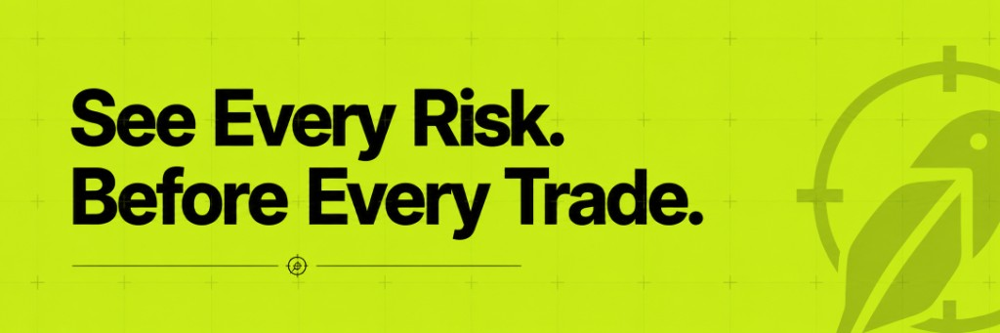

<p align="center">
  
</p>

<h1 align="center">HoodScope</h1>

<h3 align="center">AI-powered token security scanner for Robinhood Chain</h3>

<p align="center">
  <a href="https://github.com/HoodScope/HoodScope/actions/workflows/ci.yml"></a>
  <a href="https://nodejs.org"></a>
  <a href="LICENSE"></a>
  <a href="https://docs.robinhood.com/chain/"></a>
  <a href="https://hoodscope.pro"></a>
</p>

<p align="center">
  Paste any contract address — get a <strong>CLEAR</strong> / <strong>REVIEW</strong> / <strong>FLAGGED</strong> assessment with on-chain evidence.
</p>

<p align="center">
  <strong>Read-only.</strong> Never signs. Never holds funds. Never trades. It inspects — you decide.
</p>

<br>

```
 HoodScope — Robinhood Chain token  CLEAR  Score 88/100
 $0.005800  |  $5.8M mcap  |  $127.58K liq  |  $4.8M 24h vol

Key risks
  • No critical security issues detected in available data

┌─ Findings ───────────────────────────────────────────┐
│ check              │ sev    │ finding                 │
│ EXEC-CHAINID       │ OK     │ Chain ID verified       │
│ CONTRACT-OWNER     │ OK     │ Ownership renounced     │
│ CONTRACT-HONEYPOT  │ OK     │ No honeypot signal…     │
│ MKT-LIQUIDITY      │ OK     │ Liquidity depth healthy │
└──────────────────────────────────────────────────────┘
```

<br>

---

## The Problem

Robinhood Chain is a permissionless EVM L2. Permissionless + new ecosystem = real risk:

| Risk | Why it matters |
|:-----|:---------------|
| **Unverified tokens** | Anyone can deploy; the contract you're buying may be hours old |
| **Honeypots** | Token allows buys but blocks sells via transfer restrictions |
| **Liquidity traps** | Thin pools mean you may not be able to exit at a fair price |
| **Hidden permissions** | Mint, blacklist, pause, or proxy upgrade functions controlled by owner |
| **Tax manipulation** | Buy/sell taxes can be changed after you enter a position |

HoodScope turns these into a **multi-source security scan** that runs in seconds before you trade.

---

## How It Works

```
                          ┌─────────────────────────────────────────────┐
                          │         Security Signal Collection          │
                          │                                             │
  ┌──────────┐            │  RPC ─────── bytecode, owner, supply       │
  │   Web    │  Address   │  GoPlus ─── honeypot, tax, permissions      │          ┌──────────┐
  │  + CLI   │───────────▶│  DexScreener ─ price, liquidity, volume   │──Score──▶│  Engine  │
  └──────────┘            └─────────────────────────────────────────────┘          │ decide() │
                                                                                   └────┬─────┘
                                                                                        │
                                                                                 Status │
                                                                             (deterministic)
                                                                                        │
                                                                                 ┌──────▼──────┐
                                                                                 │ AI Summary  │
                                                                                 │  (optional) │
                                                                                 └─────────────┘
```

> **Key design**: the status is **deterministic** — critical findings → **FLAGGED**, score thresholds for **REVIEW** / **CLEAR**. AI only *explains* findings; it **never overrides the gate**. No API key? Deterministic fallback.

**Data sources** (public APIs only):

| Source | What it provides |
|:-------|:-----------------|
| [Robinhood Chain RPC](https://rpc.mainnet.chain.robinhood.com) | Contract bytecode, ownership, supply, proxy detection |
| [GoPlus Security API](https://gopluslabs.io) | Honeypot, taxes, mint/blacklist/pause permissions |
| [DexScreener API](https://dexscreener.com) | Price, market cap, liquidity, volume, pair age |

---

## Check Reference

| ID | Area | What it checks | Severity |
|:---|:-----|:---------------|:---------|
| `EXEC-CHAINID` | Execution | Chain ID verified via RPC | ok / danger |
| `CONTRACT-EXISTS` | Contract | Token address has deployed bytecode | ok / danger |
| `CONTRACT-OWNER` | Contract | Ownership renounced or active | ok / warn |
| `CONTRACT-VERIFIED` | Contract | Source code verified (GoPlus / Blockscout) | ok / warn |
| `CONTRACT-HONEYPOT` | Honeypot | GoPlus honeypot detection | ok / danger |
| `GOP-TAX-BUY` | Tax | Buy tax percentage | ok / warn / danger |
| `GOP-TAX-SELL` | Tax | Sell tax percentage | ok / warn / danger |
| `GOP-MINT` | Permissions | Mint function present | ok / warn |
| `GOP-PROXY` | Permissions | Proxy / upgradeable contract | ok / warn |
| `GOP-BLACKLIST` | Permissions | Blacklist capability | ok / warn |
| `GOP-TRANSFER-PAUSE` | Permissions | Transfer pause enabled | ok / danger |
| `GOP-BUY-LOCK` | Permissions | Buy restriction (`cannot_buy`) | ok / danger |
| `GOP-SELL-LOCK` | Permissions | Sell restriction (`cannot_sell_all`) | ok / danger |
| `GOP-SELF-DESTRUCT` | Permissions | Self-destruct enabled | ok / danger |
| `GOP-HIDDEN-OWNER` | Permissions | Hidden owner detected | ok / danger |
| `GOP-OWNER-PRIV` | Permissions | Elevated owner privileges | ok / danger |
| `MKT-PRICE` | Market | Live token price (DexScreener) | ok |
| `MKT-LIQUIDITY` | Market | Pool liquidity depth | ok / warn / danger |
| `MKT-MCAP` | Market | Market capitalization | ok |
| `MKT-VOLUME` | Market | 24h trading volume | ok |
| `MKT-ACTIVITY` | Market | Buy/sell transaction count | ok / info |
| `HOLD-WHALES` | Holders | Top holder concentration | ok / warn / danger |

> **Note**: GoPlus does not yet support Robinhood Chain (chain ID 4663). On Robinhood, honeypot/tax/permission checks rely on RPC + Blockscout + DexScreener.

---

## Quick Start

### Web app

```bash
git clone https://github.com/HoodScope/HoodScope.git
cd HoodScope
npm install
cp .env.example .env.local   # optional: GITHUB_TOKEN for AI summaries
npm run dev
```

Open [http://localhost:3000](http://localhost:3000) — live demo: [hoodscope.pro](https://hoodscope.pro)

### CLI

**Fastest way (Windows):**

```powershell
git clone https://github.com/HoodScope/HoodScope.git
cd HoodScope
powershell -ExecutionPolicy Bypass -File scripts/install-cli.ps1
hoodscope scan 0xYOUR_TOKEN_ADDRESS
```

**Fastest way (Mac/Linux):**

```bash
git clone https://github.com/HoodScope/HoodScope.git
cd HoodScope
chmod +x scripts/install-cli.sh && ./scripts/install-cli.sh
hoodscope scan 0xYOUR_TOKEN_ADDRESS
```

**No global install (quick test):**

```bash
npm install
npm run cli -- scan 0xYOUR_TOKEN_ADDRESS
```

Full CLI install guide: [cli/README.md](cli/README.md)

---

## Usage

```bash
# Scan a token (default chain: robinhood)
hoodscope scan 0x5fc5360D0400a0Fd4f2af552ADD042D716F1d168

# Scan on another chain
hoodscope scan 0x... ethereum
hoodscope scan 0x... base

# List capabilities
hoodscope skills

# List supported chains
hoodscope chains

# JSON for scripting (exit: 0=CLEAR, 1=REVIEW, 2=FLAGGED)
hoodscope scan 0x... --json
hoodscope scan 0x... --quiet
```

<details>
<summary><strong>Example output (REVIEW)</strong></summary>

```
hoodscope scan 0xa0b8...eb48 on Ethereum (RPC + GoPlus + DexScreener)...

 HoodScope — USD Coin (USDC)  CLEAR  Score 75/100
 $1.000700  |  $73.05B mcap  |  $884.30K liq  |  $61.00M 24h vol

Low observed security risk based on available data.

Key risks
  • Proxy Contract: Yes

Verify yourself
  • Confirm token contract address against official sources.
  • Check real pool depth on a DEX UI before trading.
  • Set tight slippage limits or use an aggregator.

Findings
check                 sev     finding
EXEC-CHAINID          ok      Chain verified (ethereum)
CONTRACT-HONEYPOT     ok      No honeypot detected
GOP-TAX-BUY           ok      Buy tax: 0.0%
GOP-PROXY             warn    Proxy Contract: Yes
MKT-LIQUIDITY         ok      Liquidity: $884.30K
```

</details>

<details>
<summary><strong>Example output (FLAGGED)</strong></summary>

```
 HoodScope — Token (TKN)  FLAGGED  Score 12/100

High-risk token — the scanner flagged blocking issues.

Key risks
  • Honeypot detected
  • Very thin liquidity ($296)
  • Buy restriction detected
```

</details>

---

## Status Reference

| Status | Score | Meaning |
|:-------|:------|:--------|
| **CLEAR** | ≥ 75 | Low observed security risk |
| **REVIEW** | 40 – 74 | Some findings deserve additional attention |
| **FLAGGED** | < 40 or critical finding | Significant security concerns detected |

Security score is **0–100** — higher is safer. Any critical finding (honeypot, sell lock, etc.) forces **FLAGGED** regardless of score.

---

## Configuration

Optional environment variables — see [`.env.example`](.env.example).

| Variable | Default | Description |
|:---------|:--------|:------------|
| `GITHUB_TOKEN` | *(unset)* | GitHub Models API token (`models:read` scope) for AI summaries |
| `HOODSCOPE_RPC_URL` | Robinhood public RPC | Override Robinhood Chain RPC endpoint |

No API keys required for GoPlus, DexScreener, or public RPC endpoints.

---

## Supported Chains

| Chain | GoPlus | Default |
|:------|:-------|:--------|
| **Robinhood Chain** | ✗ | ✓ |
| Ethereum | ✓ | |
| Base | ✓ | |
| Arbitrum | ✓ | |
| BSC | ✓ | |
| Polygon | ✓ | |
| Optimism | ✓ | |
| Avalanche | ✓ | |

---

## Development

```bash
npm run dev          # web app (localhost:3000)
npm run build        # production build
npm run lint         # eslint
npm run cli -- scan 0x...   # CLI from source
npm run cli:build    # bundle CLI package
```

See [CONTRIBUTING.md](CONTRIBUTING.md) for contribution guidelines.

---

## Roadmap

- [ ] GoPlus support for Robinhood Chain (when available)
- [ ] Transaction history via Blockscout indexer
- [ ] Liquidity lock detection
- [ ] Watch mode — continuous token monitoring
- [ ] Telegram / Discord bot interface
- [ ] Browser extension for pre-trade checks

Full roadmap: [ROADMAP.md](ROADMAP.md)

---

## Project Structure

```
HoodScope/
├── src/
│   ├── app/                   # Next.js 15 app router
│   │   ├── api/scan/          # REST scan endpoint
│   │   └── dashboard/         # Scan results UI
│   ├── components/            # Landing + dashboard UI
│   └── lib/
│       ├── api/
│       │   ├── rpc.ts         # Robinhood Chain + EVM RPC
│       │   ├── goplus.ts      # GoPlus Security API
│       │   ├── dexscreener.ts # DexScreener market data
│       │   └── blockscout.ts  # Contract verification
│       ├── scan.ts            # Scan orchestrator
│       ├── risk-engine.ts     # Security score + status
│       └── ai/                # AI summary layer
├── cli/                       # hoodscope-cli npm package
│   ├── src/commands/          # scan, chains, skills
│   └── src/format/            # Terminal report formatter
├── .cursor/skills/            # Cursor agent skill
├── docs/architecture.md
├── examples/sample_output.md
└── .github/workflows/ci.yml
```

---

## Cursor Skill

Install the HoodScope agent skill for Cursor:

```bash
cp -r .cursor/skills/hoodscope-cli ~/.cursor/skills/hoodscope-cli
```

Agents can run `hoodscope scan` locally when users ask to analyze tokens.

---

<br>

<p align="center">
  <strong>HoodScope</strong> is not financial advice. A CLEAR status means "no automated red flags" — not "safe."
</p>

<p align="center">
  Always verify contract addresses against official sources before trading.
</p>

<p align="center">
  MIT License · <a href="https://hoodscope.pro">hoodscope.pro</a>
</p>
